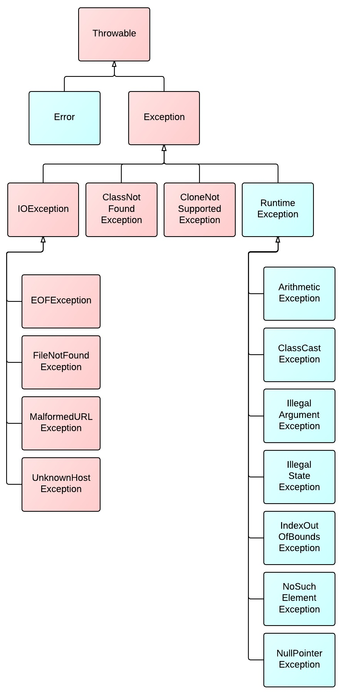

# Object Class

In Java the `Object class` is the root of all classes
- Every class in Java inherits this class

All classes in Java will have these methods defined by the Object class

- Object clone()
- boolean equals(Object o): by default this will perform == on object memory location, you can override this to compare other parts of the object
- void finalize(): this is called by the garbage collector when it determines there are no more references to the object
- Class<?> getClass()
- int hashCode(): return an int indicating the hashcode
    - If you override the equals are are also expected to override the hashCode()
    - The result of hashCode() should not change in a program
    - if .equals() returns true the hashcode should be the same
    - if .equals() returns false, the hashcode can still be the same
- String toString(): this will be called automatically if you try to print out the object with syso, typically you want to override this method otherwise it will print out the fully qualified class name
- The methods below are thread related and will be covered in more depth later on
- void notify()
- void notifyAll()
- void wait()
- void wait(long timeout)
- void wait(long timeout, int nanos)

# Abstract Classes

Abstract classes are more general classes that cannot be instantiated, they act as a template for other classes to be inherited

Abstract classes are created with the `abstract` keyword, and can contain both concrete and abstract methods
- They can also contain variables, and constructors like a normal class
- The reason we can include a constructor, is to enforce the enheriting class to set some properties of the abstract class

# Interfaces

Interfaces are a contract for methods that classes must implement
- Interfaces also cannot be instantiated

Interfaces are implicitly public and abstract
- Every method in an interface is public and abstract
- Interfaces can still have variables, but they will implicitly be public static and final
- In Java 8, default methods were added, which allows programmers to add implemetation to methods in an interface

To inherit from an interface, you must use the `implements` keyword in the class declaration
- You can implement as many interfaces as you wish on a single class
- Interfaces and extend other interfaces

# Exceptions

Exceptions are events that occur during the execution of a program, that disrupts the normal flow

What an exception occurs, Java creates an `Exception` object and it gets `thrown`

Exceptions are a way for Java, or other developers to tell us when something has gone wrong, but we are able to recover from that problem if handled correctly

## Exceptions Class Hierarchy

Exceptions in Java follow a hierarchy starting with a class called `Throwable`
- Any class that extends the `Throwable` class, creates an object that is able to be thrown with the `throw` keyword

The two main classes which extend `Throwable` are `Exception` and `Error`
- Errors are similar to Exceptions, except they typically signify a more serious issue, any typically cannot be recovered from

`Exception` class is the parent class to all exceptions in Java

`RuntimeException` class extends the Exception class



## Checked Exceptions

Caught at compile time
- MUST be handled by the programmer
- Child of `Exception` class aka anything that is not a child of `RuntimeException`

Examples Include:
- FileNotFoundException
- ClassNotFoundException
- CloneNotSupportedException

## Unchecked Exceptions

Caught during runtime
- Not required to be caught, typically going to be thrown from bugs in your code
- Children of the `RuntimeException` class

Examples include:
- ArithmaticException
- IndexOutOfBoundsException
- NullPointerException

## Handling or Declaring Exceptions

As mentioned above, all checked exceptions must be handled by the programmer

We have two ways to handle these exceptions
- try/catch block
- ducking with the `throws` keyword

## try/catch

The try/catch/finally block allows you to enclose code that may throw an exception inside of the try block

The catch block takes in a specific exception that you are expecting, and any logic to run if there is an exception

The finally block is tacked on at the end of the catch, this will run some logic reguardless of the result

```java
try{
    //we have the code that may throw an exception
} catch(FileNotFoundException fe || Exception e){
    //Whatever logic should occur if the exception is throw
} finally {
    //Whatever logic we want to occur after we are finished
}
```

Some rules for try/catch/finally
- Multiple catches are allowed, but they must go from most specific exception to specific exception
- You can catch more than one exception per catch block with the `||`
- Finally is completely optional
- try/finally is legal syntax, but a try block by itself is not legal syntax

## Ducking an exception

This is done by declaring that a method could throw a specific exception
- Use the `throws` keyword just before the starting curly brace with the specific exception it might throw

This tells Java that is it whatever entity that calls the methods responsibility to handle an exception if one occurs

## How to manually throw an exception

Inside of our program there may be a time where we want to manually throw an exception

To do so, we use the `throw` keyword along with create a new Exception object

# Custom Exceptions

Programmers are able to create custom exceptions to be throw when something specific to their program goes wrong

This could help other developers using the program/library you created know what they did wrong

Or you could use these to log things going wrong inside of your program

To create a custom exception you can do it one of two ways:
- Extend the Exception class to create a checked exception
- Extend the RunTimeException class to create an unchecked exception

Fill out the constructor to be given a custome exception message

# Try with resources

Java 7 included this new try block which automatically closes any resources declared inside of it

We have not talked about any of these resources yet, but they could include JDBC connections, INputStreams, or FileReaders

This can help us prevent memory leaks

```java
try(InputStream is = new FileInputStream("somefile.txt")){
    //do some logic
} catch(Exception e){}
```

The only caveat is that whatever resource you are trying to open in the try block must implement the `AutoCloseable` interface