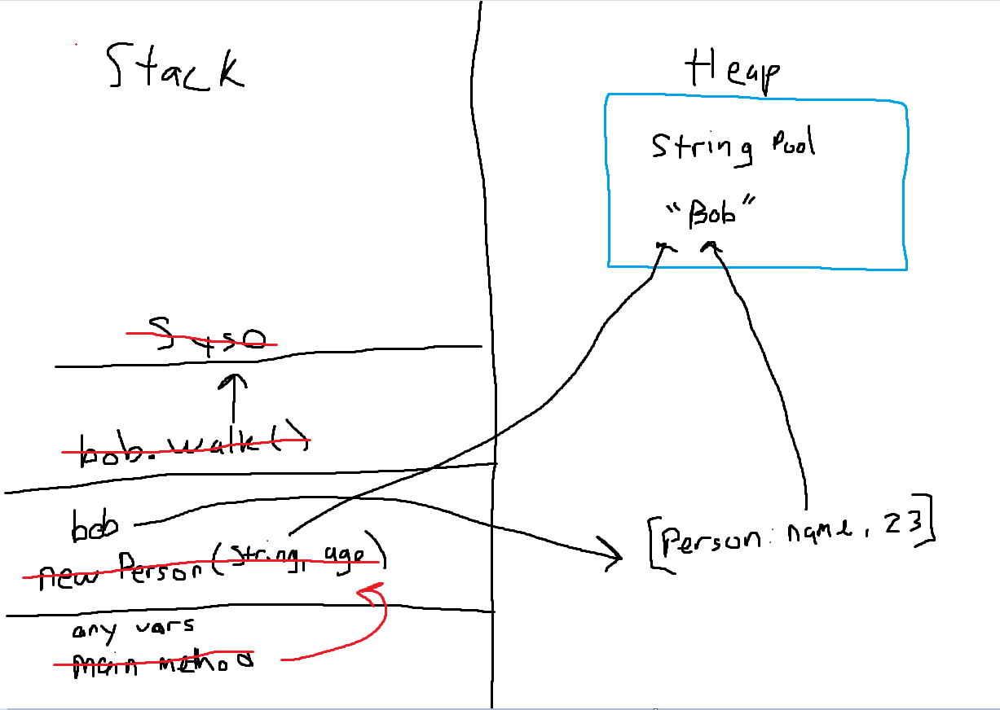

# Garbage Collection

Java automatically removes objects from memory when there is no longer a reference to it

You cannot explicitly call for garbage collection, but you can suggest

- System.gc()
- Runtime.getRuntime().gc()
- System.runFinalize()
    - Finalize is an inherited method from the object class, you can override it to implement from logic to run before your object is destroyed

```java
Object o1 = new Object();   //1. A new object is created in memory, and variable o1 references it
Object o2 = new Object();   //2. Another new object is created in memory and variable o2 references it
Object o3 = o1;             //3. variable o3 is now going to reference the first object in memory
o2 = o3;                    //4. variable o2 is now going to reference the first object in memory,
                            // Now the second the second object we created has no references
//Now at some point, java will see that the second object has no references, and will eventually
//be removed from memory
```

# Data Structures

An object used to efficiently store and access data
- Some prioritize data access, some prioritize data modification

There are many different types of data structure, typically, each one does some specific task very well

Our two main types of Data structure are Linear, Hierarchical:

## Linear Data Structures

Arranges data in an orderly manner where each item is attached adjancently
- All the elements can be accessed in a single run
- There are typically simple to implement
- Have single level
- Are memory inefficient

Linear Data structures include:
- Lists
- Sets
- Stack
- Queues
- Maps

## Hierarchical Data Structures

Arranges elements in some sorted order, or has some relationship other than a sequence between the elements
- Cannot be accessed in a single run time
- Complex to implement
- Multi-leveled
- Memory Effiecient

Hierarchical Data structures:
- Maps
- Graphs
- Trees

## Stack

A linear data structure which follows First in Last out ordering

As you add elements to the stack they get added to the top, as you take items off you take them from the top, until you reach the bottom last element

## Heap

A heap is a speical tree based structure in which the tree is a complete binary tree
- A binary tree is a tree structure where each parent node has at most 2 children
- A complete binary tree is a tree structure where each parent node has exactly two children

# Java stack and heap memory

## Heap Memory

Memory for objects in the program
- This store the refences to objects that we create throughout our program
- When we use the new keyword this will store an object in the heap
- If we run out of heap memory OutOfMemoryError

## Stack Memory

Memory that holds meothod calls, primitive values, and reference variables needed for method calls
- The stack follows First in Last out
- When a method/constructor is called its put at the top of the stack
    - Any values of refences needed will be found in the heap
    - When the method or constructor is finsihed, it is popped off the top of the stack, until the program has no method calls left
- If we run out of stack memory a StackOverflowError occurs



# Data structure Team Research Assignment

Present/Report on:
- What is your data structure?
- Are there different implementations? What are they?
- What is your data structure useful for?
    - Where would you want to use it vs not want to use it?
    - Are their certain implementations of your datastructure that are more useful than others?

Implemention
- What version of the data structure did you implement?
- How did you implement it?
- What are the most basic methods needed to access elements stored?
- How do you go about adding or deleting elements?

## Breakout room 1: Lists

## Breakout room 2: Stacks

## Breakout room 3: Queues

## Breakout room 4: Tree