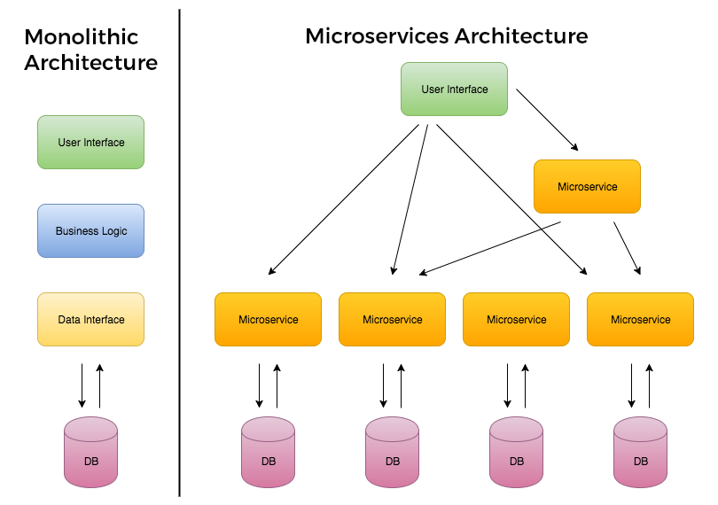

# Intro to Microservices

## Monolithic Architecture
Monolithic applications are designed to handle multiple related tasks. 
They’re typically complex applications that encompass several tightly coupled 
functions.

For example, consider a monolithic ecommerce SaaS application. It might contain a 
web server, a load balancer, a catalog service that services up product images, 
an ordering system, a payment function, and a shipping component.

As you can imagine, given their broad scope, monolithic tools tend to have huge 
code bases. Making a small change in a single function can require compiling and 
testing the entire platform, which goes against the agile approach today’s developers 
favor.

## Service-Oriented Architecture (SOA)
Software systems were initially designed as monolith applications that were hard to 
manage. The emergence of client-server architecture and the separation of user 
interface, business logic, and database improvised on the earlier approach with their 
modularity. The SOA took it a step further by providing a framework in which 
applications are perceived as a collection of services that communicate with each other 
through a common network protocol.

The SOA consists of two important roles – service provider and service consumer. A 
provider is the one that implements a certain technical or business objective. The 
consumer makes a call to the provider in order to leverage its functionalities. 
The consumer sends a request and the provider comes back with a response. 
The request-response paradigm here follows a standard messaging or communication 
protocol that both parties can understand.

Some of the commonly used technologies to achieve this communication are *WSDL* (Web 
Services Description Language), *SOAP* (Simple Object Access Protocol), and *REST* 
(Representational State Transfer).

Services are defined by the following properties:
 * Logically represents a business activity with a specified outcome: Services are 
usually identified as logical units that have a specific, narrow purpose. For example, 
a Logger service manages all the logging functionalities of your application. 
Irrespective of whether it’s the UI, server, or database, the Logger service can 
be reused for logging purposes.
 * Self-contained: The logic inside a service is independent of any other service or 
process. So, if you make changes to algorithms inside the Logger service, it does not 
impact any other service as long as the interface isn’t broken. This property allows 
loose coupling between various services, allowing you to change technologies used or 
optimize your code without impacting other processes.
 * Black box for its consumers: A consumer of a service does not have any knowledge of 
what happens inside the service it invokes. For example, let’s say there is a 
CustomerInformation service. Initially, the service might have been pulling information 
from database tables, but later it might extract data from social media channels. 
The consumer has no awareness of this change.
 * Consists of other underlying services: A service can use other services to 
achieve its business goal. For example, a Logger service may in-turn use a ReadWrite 
service that can write text into a file in a certain format.

## Microservice Architecture (MSA)
Microservice Architecture describes a way of designing software applications as suites of independently deployable services.

"..the microservice architectural style is an approach to developing a single application as **a suite of small services**, each **running in its own process** and communicating with lightweight mechanisms, often an HTTP resource API. These services are **built around business capabilities** and independently deployable by fully automated deployment machinery. There is a **bare minimum of centralized management** of these services, which may be written in different programming languages and use different data storage technologies. "   -- **James Lewis and Martin Fowler (2014)**

"Microservices are small, autonomous services that work together." -- **Sam Newman**

In a microservice architecture, we divide an application into **services**. Each service runs a unique process and manages its database. A service can generate alerts, log data, support user interfaces (UIs), handle user identification or authentication, and perform various other tasks.

The microservice paradigm provides development teams with a more decentralized approach for building software. Most companies in the world – *like Amazon, Netflix, Uber, Etsy, etc.,* have adopted the microservices architecture for developing their applications. Over time, these enterprises dismantled their monolithic applications and refactored them into microservice-based architectures. This has given them scaling advantages, greater business agility, and increased profits.

Microservice architecture is generally considered an evolution of SOA as its services are more fine-grained, and function independently of each other. Therefore, if one of the services fail within an application, the app will continue to function since each service has a distinct purpose. The services in microservices communicate via  application programming interfaces (APIs) and are organized around a particular business domain. Together, these services combine to make up complex applications.

Since each service is independent, a microservice architecture can scale better than  other approaches used for application building and deployment. This characteristic also gives microservice applications more fault tolerance than other application development methods. Microservices are frequently built and deployed in the cloud; in many instances they operate in containers.

### Netflix
Netflix started as a website that allowed us to select DVDs and delivers that to our mailbox. It also began as a monolithic application, built and managed with a traditional development model by a single team of over 100 engineers.

As the company transitioned to a product that delivers streaming content to millions of viewers all over the world, 24 hours a day, **Netflix also had to switch to a microservice architecture** that facilitates receiving content from various sources, getting it into its systems, processing it, and distributing it to users seamlessly.

Each day, Netflix’s API receives hundreds of millions of calls, which travel between microservices to accomplish a task. When you click the play button on a movie, you might trigger a chain of five API calls which keep track of playback, collect content for the user interface, manage streaming, and more.

Netflix also leverages serverless architectures, which fits well with microservices, to encode this content, backup files, secure their assets, and monitor their IT environment.

## Microservice Architecture vs Monolithic Applications

We build monolithic applications as a single unit. They usually develop these Enterprise Applications in three major parts:

- **User Interface** - might consist of HTML pages and JavaScript running on the user’s browser.
- **Server-Side application** - handles incoming data (like HTTP requests), executes domain logic, retrieves and updates data from the database, and updates the user interface
- **Databases** - stores data on the tables of an RDBMS.

Any minor changes in the system require building and deploying a new version of the server-side application. Over time, it’s often hard to keep a good modular structure, making it harder to manage changes that ought to only affect one module within that application. Scaling requires scaling of the entire application rather than the parts of it that require the most resources.

These frustrations have led to the **microservice architectural style**, building applications as suites of services. When services are independently deployable and scalable, each service provides a firm module boundary. We can develop services in distinct programming languages.

- Services are deployed and updated independently, which gives more flexibility.
- Monolithic uses a shared database. Each microservice uses a single database. Each service can use any database system (MySQL, Oracle, NoSQL) depending on its business logic.
- Monolithic applications are tightly coupled. Here, it is difficult to change technology or language or framework. MSA ensures that the services are loosely coupled, so it's easy to make changes since services are independent to each other.
- Monolithic applications are more compatible with [Waterfall Model](https://en.wikipedia.org/wiki/Waterfall_model). MSA is adaptable with [Agile Methodology](https://en.wikipedia.org/wiki/Agile_software_development) for developing applications.

### Monolith vs. MSA

| Monolithic | MSA |
| ------ | ------ |
|Simple to develop and deploy. | Complex and hard to develop and deploy. |
| Code changes affect the entire system.	| Only the microservice that is changed would be affected.| 
| One codebase and one shared database. |	A codebase and database for each microservice. |
|Hard to scale or upgrade. |	Easy to scale and upgrade. |
|Less expensive and faster to develop. |	More expensive and takes more time to develop. |
| Monolithic uses a shared database. | Each microservice uses a single database. Each service can use any database system (MySQL, Oracle, NoSQL) depending on its business logic. |
| Monolithic applications are tightly coupled. Here, it is difficult to change technology or language or framework.| MSA ensures that the services are loosely coupled, so it's easy to make changes since services are independent to each other. |
|The entire system can be affected by a single error or bug. |	The entire system is shielded from the error or bug on one microservice.|

### SOA vs. MSA

| SOA | MSA |
| ------ | ------ |
| Designed to share resources across services | Designed to host services which can function independently |
| Larger, more modular services	| Fine-grained services | 
| Involves sharing data storage between services |	Each service can have an independent data storage |
| Less flexibility in deployment | Quick and easy deployment |

## References
* [Martin Fowler - Defining Microservices](https://martinfowler.com/articles/microservices.html)
* [Video Tutorial - MSA vs Monolithic](https://www.youtube.com/watch?v=CdBtNQZH8a4)
* [Martin Fowler - Defining Microservices](https://martinfowler.com/articles/microservices.html)
* [Adopting Microservices at Netflix](https://www.nginx.com/blog/microservices-at-netflix-architectural-best-practices/)