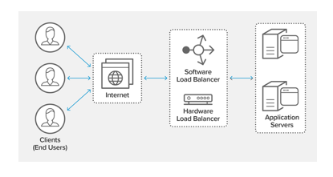

# Load Balancing

In a microservice architecture, multiple instances of each microservice are deployed for availability and scalability. This limits the impact of the failure of a single instance and maintains overall system reliability. Successfully adopting this architecture requires a **load balancing mechanism** to ensure that incoming requests are spread across all of the available instances, rather than overloading some instances at the same time, while other instances are under-utilized.

A **load balancer** acts as the *traffic cop* sitting in front of our servers, and routs client requests across all servers capable of fulfilling those requests. It does so in a manner that maximizes speed and capacity utilization, and ensures that no one server is overworked, which could degrade performance. If a single server goes down, the load balancer redirects traffic to the remaining online servers. When a new server is added to the server group, the load balancer automatically starts sending requests to it.



[Netflix Ribbon](https://github.com/Netflix/ribbon/wiki) is a client-side load balancer that gives you a lot of control over the behavior of HTTP and TCP clients. 

### Ribbon — Load Balancing

When Zuul receives a request, it picks up one of the physical locations available and forwards requests to the actual service instance. Internally, Zuul uses Netflix Ribbon to lookup for all instances of the service from the service discovery (Eureka Server) and routes the external request to an appropriate service instance.

```yml
ribbon:
  MaxAutoRetries: 1
  MaxAutoRetriesNextServer: 2
  OkToRetryOnAllOperations: true
```

By default Ribbon uses [round robin](https://en.wikipedia.org/wiki/Round-robin_scheduling) to lookup services available. If we want to handle load balancing ourselves, we can add the below properities in the Zuul Server

```yml
ribbon:
 eureka:
   enabled: false 
      listOfServers: localhost:8000,localhost:9092,localhost:9999 
```

## References

* [Load Balancers and Microservices](https://blog.radware.com/applicationdelivery/2017/11/load-balancers-microservices/#:~:text=Enter%20the%20Load%20Balancer!&text=In%20order%20to%20scale%20the,or%20a%20load%20balancer%20provides.)


