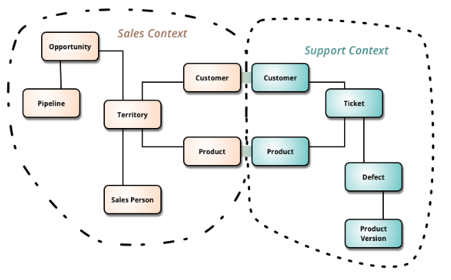

## Characterics of Microservices Architecture

* Microservice architecture encourages us to break our application into **multiple individually deployable components**. Here, a component refers to a unit of software that is independently replaceable and upgradeable. These components expose their functionality as **services** and serve a business purpose. Components are loosely coupled and communicate with each other through pre-defined protocols, such as message queues, HTTP request/response models, and so on.

* Services are organized based on the business capabilities, not by the technology.

* Each service has its own database, either different instances of the same database technology, or entirely independent database systems - an approach called [Polyglot Persistence](https://www.jamesserra.com/archive/2015/07/what-is-polyglot-persistence/#:~:text=Polyglot%20Persistence%20is%20a%20fancy,dealt%20with%20different%20data%20stores). 

* MSA provides **infrastructure automation** with [continuous delivery](https://en.wikipedia.org/wiki/Continuous_delivery) and [automated testing](https://smartbear.com/learn/automated-testing/what-is-automated-testing/).

* Any service’s failure should be in **isolation**. Failure of one service should not make the whole application go down. Since services can fail, it’s important to detect the failures and, if possible, restore the service. 

## Challenges of Microservices Architecture

Microservice architecture is much more complex than legacy systems. This environment becomes more complicated because teams have to manage and support many moving parts. Some of the challenges that an organization faces are:

* **Bounded Context** - The bounded context is a central pattern in [Domain-Driven Design(DDD)](https://en.wikipedia.org/wiki/Domain-driven_design). DDD deals with large models by dividing them into different Bounded Contexts and being explicit about their interrelationships. Bounded context defines our domain boundaries in the business context.

For example, a product in the sales context refers to an item in the process of being sold. A product in the support context refers to the item that is already sold to the customer which has some defects, so the customer contacts the support team. 

* Finding a root cause for problems – Distributed logic with distributed data increases the effort of finding a root cause. 
* Version management and cyclic dependencies between services.
* Logging is distributed between services.
* An issue that’s caused by one service can cause trouble elsewhere.

## References

*  [Martin Fowler - Microservice Guide](https://martinfowler.com/microservices/)
