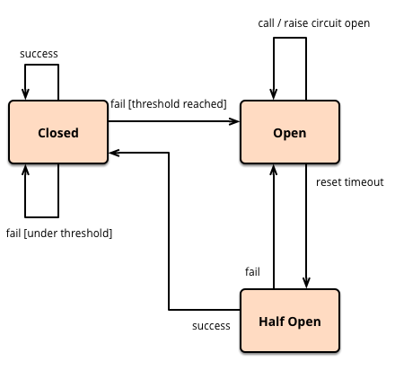
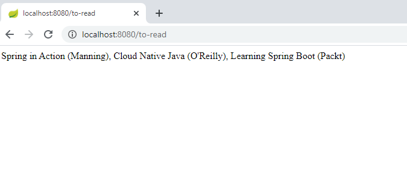
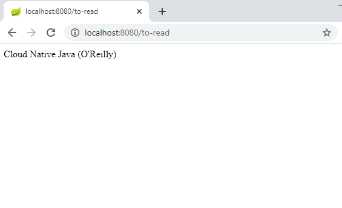

# Circuit Breaker

Services sometimes collaborate when handling requests. When one service synchronously invokes another there is always the possibility that the other service is unavailable or is exhibiting such high latency that it's essentially unusable. Precious resources such as threads might be consumed in the caller while waiting for the other service to respond. This might lead to resource exhaustion, which would make the calling service unable to handle other requests. The failure of one service can potentially cascade to other services throughout the application.

To prevent a network or service failure from cascading to other services, we use the [circuit breaker pattern](https://en.wikipedia.org/wiki/Circuit_breaker_design_pattern#:~:text=Circuit%20breaker%20is%20a%20design,failure%20or%20unexpected%20system%20difficulties.) for building a microservice application.

A circuit breaker wraps a function call with a monitor where the monitor will be tracking potential failures. If the service is in the failed stage, the circuit will send the error message without making a call. If the service is up, then breaker forwards the call to the needed service.

The circuit breaker has 3 distinct states – 
1. **Closed State** - When  service is up and running, the circuit breaker remains in the closed state and all calls pass through to the services. 
2. **Open State** - When the number of failures exceeds a predetermined threshold the breaker trips, and it goes into the Open state. In the OPEN state the circuit breaker returns an error for all calls to the service without making the calls to the Supplier Microservice.
3. **Half-Open State** -  The circuit breaker makes a trial call to the failed service periodically to check if it has recovered. If the call to the service times out, the circuit breaker remains in the Open state. If the call returns successfully, then the circuit switches to the closed state.



[Netflix's Hystrix](https://github.com/Netflix/Hystrix/wiki) library provides an implementation of the circuit breaker pattern. It helps to control the interaction between services by providing fault and latency tolerance. It improves overall resilience of the system by isolating failing services and halting the cascading effect of failures.

When you apply a circuit breaker to a method, Hystrix watches for failing calls to that method, and if failures build up to a threshold then Hystrix opens the circuit so that subsequent calls automatically fail. While the circuit is open, Hystrix redirects calls to the method, and they are passed to your specified fallback method.

### Example

Let's create a few microservice instances and test how the Hystrix works.

Create a client application (Bookstore) with only the Web dependency. 
```java
@RestController
@SpringBootApplication
public class BookstoreApplication {

	@RequestMapping(value = "/recommended")
	public String readingList() {
		return "Spring in Action (Manning), Cloud Native Java (O'Reilly), Learning Spring Boot (Packt)";
	}

	public static void main(String[] args) {
		SpringApplication.run(BookstoreApplication.class, args);
	}

}
```

In `application.properties` file, set `server.port`to consume the Bookstore service.
```properties
server.port=8090
```
Create another application (Reading) with the Web and Hystrix dependencies. 

```java
@EnableHystrix
@RestController
@SpringBootApplication
public class ReadingApplication {

  @Autowired
  private BookService bookService;

  @Bean
  public RestTemplate rest(RestTemplateBuilder builder) {
  return builder.build();
  }
  //To retrieve the list from the Bookstore service.
  @RequestMapping("/to-read")
  public String toRead() {
  return bookService.readingList();
  }

  public static void main(String[] args) {
  SpringApplication.run(ReadingApplication.class, args);
  }
}
```
`@EnableHystrix` annotation tells Spring Cloud that the reading application uses circuit breaker (Hystrix) and to enable their monitoring, opening, and closing.

Spring Cloud Netflix Hystrix looks for any method annotated with the `@HystrixCommand` annotation and wraps that method in a proxy connected to a circuit breaker so that Hystrix can monitor it. This works only in a class marked with `@Component` or `@Service`. 

Let's create a BookService class and mark with `@Service` which contains a method annotated with the `@HystrixCommand` annotation.
```java
@Service
public class BookService {

  private final RestTemplate restTemplate;

  public BookService(RestTemplate rest) {
  this.restTemplate = rest;
  }

  @HystrixCommand(fallbackMethod = "reliable")
  public String readingList() {
  URI uri = URI.create("http://localhost:8090/recommended");
  return this.restTemplate.getForObject(uri, String.class);
  }

  public String reliable() {
  return "Cloud Native Java (O'Reilly)";
  }

}
```
The RestTemplate is injected into the constructor of the BookService when it is created. Here, we have applied `@HystrixCommand` to our original `readingList()` method. Also, there is a new method here: `reliable()`. The `@HystrixCommand` annotation has reliable as its fallbackMethod. If, for some reason, Hystrix opens the circuit on `readingList()`, we have an excellent placeholder reading list ready for our users.

To test our circuit breaker, first let's run both the Bookstore service and the Reading service. 

Then, visit `localhost:8080/to-read`: 



Now, stop the bookstore application. Our list source is gone, but Hystrix loads the reliable abbreviated list to stand in the gap.

If we visit `localhost:8080/to-read`, we able to see the reliable abbreviated list:




## References

* [Circuit Breaker](https://martinfowler.com/bliki/CircuitBreaker.html)
