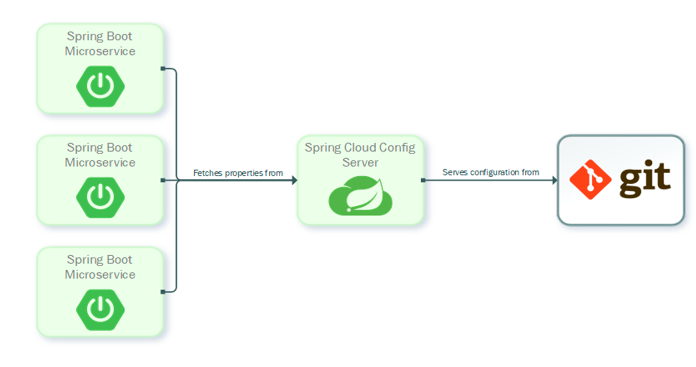

# Configuration Servers

In the cloud, configuration can’t simply be embedded inside the application. The configuration has to be flexible enough to cope with multiple applications, environments, and service instances, as well as deal with dynamic changes without downtime. 

[Spring Cloud Config](https://spring.io/projects/spring-cloud-config) is designed to ease these burdens and offers integration with version control systems like Git to help you keep our configuration safe.

Spring Cloud Config provides server-side and client-side support for externalized configuration in a distributed system. With Spring Cloud Config Server, we have a central place to manage external properties for applications across all environments. Services can consume their application properties from the Config Server rather than loading them locally from the file system or classpath. Configuration is not stored in the Config Server itself but pulled from a Git repository. This allows us to manage our application configuration with all the benefits of version control. 



***Spring Cloud Config Server*** - Spring Cloud Config Server provides an HTTP resource-based API for external configuration (name-value pairs or equivalent YAML content). The server is embeddable in a Spring Boot application, by using the `@EnableConfigServer` annotation.

```java
@SpringBootApplication
@EnableConfigServer
public class ConfigServer {
  public static void main(String[] args) {
    SpringApplication.run(ConfigServer.class, args);
  }
}
```
We can also set a default configuration git repository in `application.properties` file:
```
server.port: 8888
spring.cloud.config.server.git.uri: file://${user.home}/config-repo
```

The Config Server stores the configuration data with the help of `EnvironmentRepository` and serves a `Environment` object to the client. The `Environment` resources are parametrized by three variables:

* `{application}` - maps to `spring.application.name` on the client side.
* `{profile}` - maps to `spring.profiles.active` on the client.
* `{label}` - it is a server side feature labelling a "versioned" set of config files.

***Spring Cloud Config Client*** -  Spring Cloud Config Client binds to the Config Server and initialize Spring `Environment` with remote property sources. All client applications that want to consume the Config Server need a `bootstrap.yml` (or an environment variable) with the server address set in `spring.cloud.config.uri` (it defaults to "http://localhost:8888"). 
The client application has the following bootstrap configuration in the `bootstrap.yml` file:
```
spring:
  application:
    name: foo
  profiles:
    active: dev,mysql
 ```   


## References

* [Spring Cloud Config](https://cloud.spring.io/spring-cloud-config/reference/html/)
