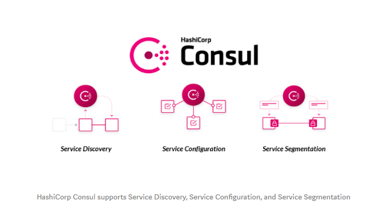
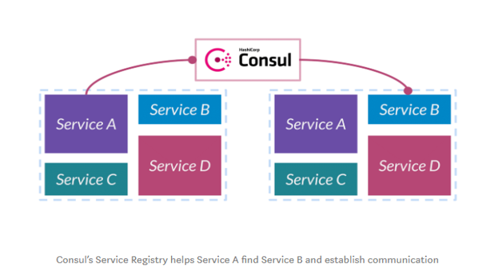
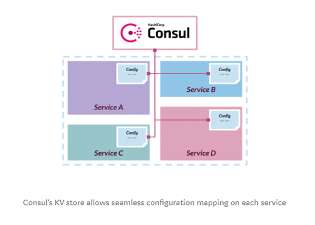
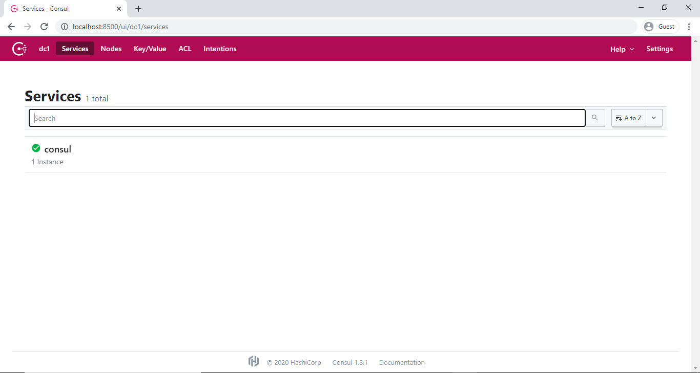
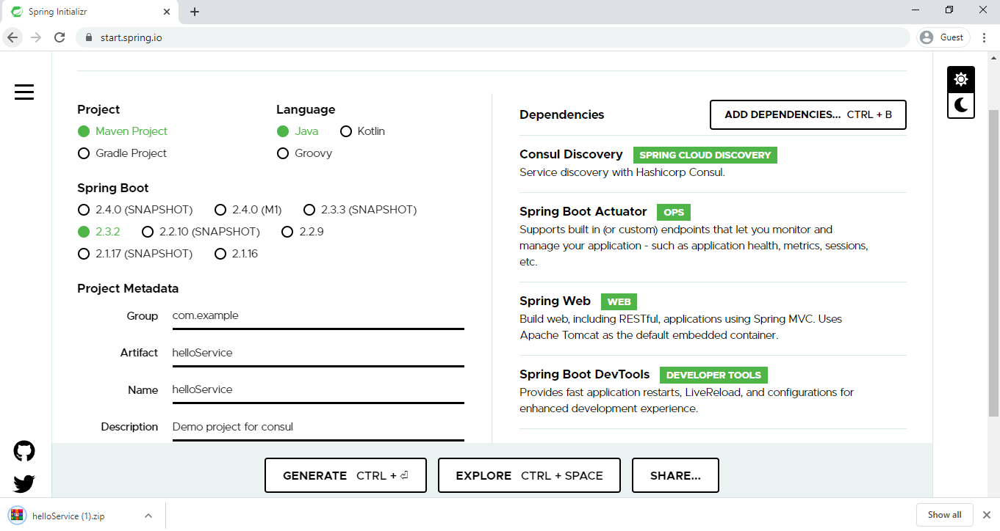
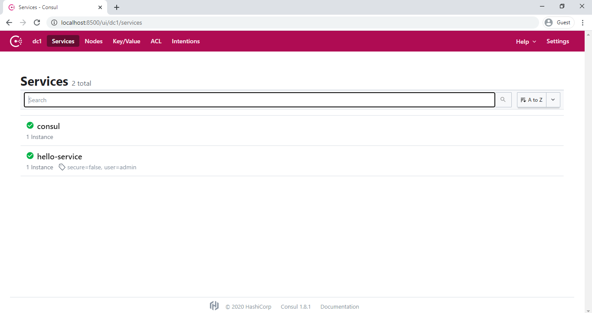
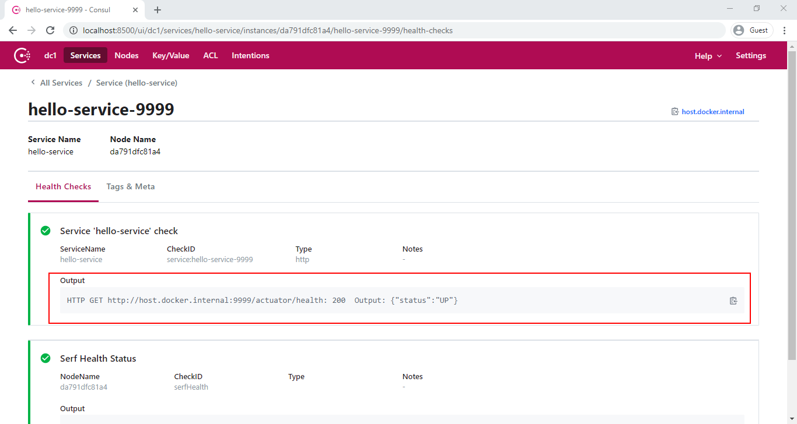

# Consul

Microservices and other distributed systems can enable faster, simpler software development. But there's a trade-off resulting in greater operational complexity around inter-service communication, configuration management, and network segmentation. [**HashiCorp Consul**](https://www.hashicorp.com/products/consul/) is an open source tool that solves these new complexities by providing *service discovery*, *health checks*, *load balancing*, *a service graph*, *mutual TLS identity enforcement*, and *a configuration key-value store*. These features make Consul an ideal control plane for a **Service Mesh**.

 

**Consul Agent** - The [Consul agent](https://www.consul.io/docs/agent) is the core process of Consul. The agent maintains membership information, registers services, runs checks, responds to queries, and more. The agent must run on every node that is part of a Consul cluster.

# Consul Service Mesh

Service mesh solves the networking and security challenges of operating microservices and cloud infrastructure. Consul is a service mesh solution that offers a software-driven approach to routing and segmentation. It also brings additional benefits such as failure handling, retries, and network observability.

Let's us discuss about the challenges with microservice architecture and how Consul solves these complex challenges and makes easy to work with microservices.

## Service Discovery

**Service Discovery in a monolithic application** -  Let's say *service A* wants to call *service B*. So, we would expose a method, mark it as public, in *service B* and then *service A* can just call it. They're in the same application. It's just an in-memory function call. 

In a monolithic application, the services would expose public functions and it would simply call the function across services. 

**Service Discovery in MSA** - Here, we deploy *service A* and *service B* as an independent deployable units in a distributed environment. If *service A* wants to call *service B*, then *service A* needs to know the location (IP address) of the *service B*. So, the challenge here is: "How do these different services discover one another in our distributed environment?" 

**Consul’s solution** for this service discovery problem is a central **service registry**.

Consul maintains a central registry that contains the entry for all the upstream services. When a service instance starts, it gets registered on the central registry. The registry is populated with all the upstream instances of the service.



**Example** - When a *service A* wants to talk to *service B*, it will discover and communicate with *B* by querying the registry about the upstream service instances of *B*. 

Consul also provides **health-checks** on these service instances. If one of the service instances or services itself is unhealthy or fails its health-check, the registry would then know about this scenario and would avoid returning the service’s address. 

Consul programmatically manages registry, which gets updated when any new service registers itself and becomes available for receiving traffic. 

## Service Configuration

**Configuration management in a monolith application** - In monolithic application, we would have all our configuration in a single XML file that configures the whole thing. The advantage of this is that all of our different subsystems, all of our components, had a consistent view of the configuration. 

As an example, suppose we wanted to put our application in maintenance mode. We wanted to prevent it from writing to the database so that we could do some upgrades in the background. We would change this configuration file and then all of these subsystems would believe that we're in maintenance mode simultaneously.

**Configuration management in a MSA** - The challenge here is: "How do we think about configuration in our distributed environment?"

The second big challenge we run into is configuration.

**Consul’s solution** for this configuration management is the central **Key-Value store**.

Instead of trying to define the configuration in each service distributed throughout our infrastructure, Consul uses a key-value store to capture it centrally.



**Example** - We can define a key centrally that says whether our system is in maintenance mode or not , "Are we in maintenance mode?"  and the values can be "true or false". Also, we have to change some default configuration in each service depending upon the state of our system. When the system is in maintenance mode, we change the "Are we in maintenance mode?" key's value centrally from "false to true". Then, push out the changed state to all our services and configure them. Thus, gives consistent view of configuration across all the services.

## Service Segmentation

In microservice environment, we have hundreds of unique services across different network zone. Traffic pattern between these services are much more complicated. Many services have complicated [east-west traffic flow](https://en.wikipedia.org/wiki/East-west_traffic). The challenge here is: "How do we think about segmenting this network?" and "How do we partition which services are allowed to talk to which other services?"

The third challenge we run into is segmentation. Consul deals with this is with a feature called **Connect**.

Consul Connect establishes inter-service communication polices by using service graph. With the **Service Graph**, we can define - which service can talk to which other service. So, we might say, "*A* is able to talk to *B*" and "*C* is allowed to talk to *D*". Here, we're not talking about IP to IP. We're not saying IP 1 can talk to IP 2. We're talking about "*service A* can talk to *service B*".

The higher benefit of this is, it is not IP restricted. Rather it’s service level. This makes scalable independent of our distributed network. The policy will be enforced on all instances of service also, there won't be any hardbound firewall rules specific to a service’s IP. 

So, when we say "*service A* can talk to *service B*", how do we know what is *service A* and what is *service B*? and how do we authorize the identity of each service?.

Consul Connect provides service-to-service connection authorization and encryption using **mutual Transport Layer Security (TLS)**. We issue TLS certificates that uniquely identify these services. So we can uniquely say, "This is service A and this is service B. Unlike saying, "There's an IP and we don't actually know what's running at that IP with any strong guarantee."

Consul enforces TLS using an agent-based proxy attached to each service instance. This proxy acts as a sidecar. Applications can use **sidecar proxies** in a service mesh configuration to establish TLS connections for inbound and outbound connections without being aware of Connect at all. Applications may also natively integrate with Connect for optimal performance and security. Connect can help you secure your services and provide data about service-to-service communications.


We probably have many hundreds of services that exist are not TLS aware. So the advantage of imposing it at the proxy layer is that we can get that guarantee of our data being encrypted in transit without needing to re-implement all of these applications. These sidecar proxies prevents us from making any change into the code of original service.

After authorizing the identity of *service A* and *service B*, these proxies call the service graph and looks for a policy like this — 'Is there a rule that allows *service A* to talk to *service B*?'. If so, then the proxies allow that traffic to take place, A is allowed to talk directly to B through an encrypted channel.

> **NOTE:** Consul "connect", HashiCorp's service mesh feature, provides service-to-service networking and security through connection authorization and encryption using mutual Transport Layer Security (mTLS). Applications deployed with the "connect" feature can use sidecar proxies in a service mesh configuration to establish TLS connections for inbound and outbound connections, without being aware of Consul at all.

----
### Summary - Consul Service Mesh 

* Consul addresses the new microservices architecture challenges with **service discovery** and allowing operators to deploy applications into a [**zero-trust network**](https://www.cloudflare.com/learning/security/glossary/what-is-zero-trust/).
* Consul offers us a [service catalog](https://en.wikipedia.org/wiki/Service_catalog), health checks, automatic load balancing, and geo-failover across multiple instances of the same service.
* Consul service mesh uses **mutual TLS** (mTLS) and will automatically generate and distribute the TLS certificates for every service in the mesh. The certificates are used for both:
    * service identity verification
    * service communication encryption
* Consul service mesh deploys **sidecar proxies** locally alongside each service instance, which transparently handles inbound and outbound service connections, automatically verifying and encrptying TLS connections between services.
* Consul also helps us to secure service communication at the network level by enabling us to manage service-to-service communication permissions using [intentions](https://www.consul.io/docs/connect/intentions.html). **Intentions** define service based access control for services in the Consul service mesh and are used to control which services are allowed or not allowed to establish connections.
* In addition to securing our services, Consul service mesh can also intercept data about service-to-service communications and surface it to **monitoring tools**.
-----


# Spring Cloud Consul

The Spring Cloud Consul project provides easy integration with **Consul** for Spring Boot applications. With a few simple annotations we can quickly enable and configure the common patterns inside our application and build large distributed systems with [Hashicorp’s Consul](https://www.consul.io/). The patterns provided include Service Discovery, Control Bus and Configuration, Intelligent Routing (Zuul) and Client Side Load Balancing (Ribbon), Circuit Breaker (Hystrix) are provided by integration with Spring Cloud Netflix.

## Example 

In this example, we will be running consul server using docker. So, we will need to install docker before installing consul.

You can refer this [link](https://gitlab.com/revature_training/docker-team/-/blob/master/modules/docker-concepts/installing-docker.md) to install docker.  

After that, follow the below steps to install consul using the docker image:

 * First of all, we need to download the docker image of consul from the docker hub. To pull the consul image, run the `docker pull consul` command on the terminal. 

* Next, we need to run the Consul Agent locally on port **8500** (default port for consul) using `docker run -d --name consul -p 8500:8500 consul` command.

* Then, start the consul server with `docker start consul` command. Now, the consul container is up and running on the port 8500. You can check if it is available by navigating to http://localhost:8500/ui in your browser.

You able to see:



> **NOTE:** You can stop the consul server with `docker stop consul` command.

Now, let us create a simple microservice application and we'll make that service register its instance with the Consul.

Navigate to the [Spring Initializr](https://start.spring.io/) and create the Spring Boot project with Consul Discover, DevTools, Actuator, and Web dependencies. The following image shows the Initializr set up for the Eureka server application:



The preceding image shows the Initializr with Maven chosen as the build tool. It also shows values of `com.revature` and `helloSerive` as the Group and Artifact, respectively.

Open the the main application class file and enable the discovery client configuration by annotating the class with  `@EnableDiscoveryClient`.

```java
package com.revature.helloService;

import org.springframework.boot.SpringApplication;
import org.springframework.boot.autoconfigure.SpringBootApplication;
import org.springframework.cloud.client.discovery.EnableDiscoveryClient;

@EnableDiscoveryClient
@SpringBootApplication
public class HelloServiceApplication {

	public static void main(String[] args) {
		SpringApplication.run(HelloServiceApplication.class, args);
	}

}
```

Then, we add a REST Controller class and implement a GET method in that.

```java
package com.revature.helloService.controllers;

import java.util.Date;
import org.springframework.web.bind.annotation.GetMapping;
import org.springframework.web.bind.annotation.RestController;

@RestController
public class HelloServiceController {

	@GetMapping("/hi")
	public String message() {
		return "Hello User !! " + new Date();
	}

}
```

We configure the below properties in *application.properties* file to register this service in Consul Server.

```properties
spring.application.name= hello-service
server.port=9999
#Setting desired port and name for this service
       
spring.cloud.consul.discovery.metadata.map = user=admin
#consul metadata
```

When we run this `helloService` application, it registers itself in Consul server automatically. 

In the console, you able to see the logs of `hello-service`  registering with consul.
```
2020-08-03 09:38:52.052  INFO 17104 --- [  restartedMain] o.s.c.c.s.ConsulServiceRegistry          : Registering service with consul: NewService{id='hello-service-9999', name='hello-service', tags=[secure=false], address='host.docker.internal', meta={map=user=admin}, port=9999, enableTagOverride=null, check=Check{script='null', dockerContainerID='null', shell='null', interval='10s', ttl='null', http='http://host.docker.internal:9999/actuator/health', method='null', header={}, tcp='null', timeout='null', deregisterCriticalServiceAfter='null', tlsSkipVerify=null, status='null', grpc='null', grpcUseTLS=null}, checks=null}
2020-08-03 09:38:52.417  INFO 17104 --- [  restartedMain] c.r.h.HelloServiceApplication            : Started HelloServiceApplication in 5.844 seconds (JVM running for 6.993)
```

To verify that, visit http://localhost:8500/ui/ on our browser. You able to see the `hello-service` registered in the Consul server:



**HTTP Health Checks** - The health check for a Consul instance defaults to "/health", which is the default locations of a useful endpoint in a Spring Boot Actuator application.  When you visit http://localhost:9999/actuator/health, you able to see:
```json
{"status":"UP"}
```
This implies that our `hello-service` is healthy. Also, you can able to see the health status of `hello-service` on the consul dashboard:



We can change default health check path using `spring.cloud.consul.discovery.healthCheckUrl`  property. Also, we can set the health check intervals using `spring.cloud.consul.discovery.healthCheckInterval` property.

In *application.properties* file,
```properties
spring.cloud.consul.discovery.healthCheckUrl = http://myserver.com:${server.port}/status
spring.cloud.consul.discovery.healthCheckInterval = 15s
```

You can disable the health check by setting `management.health.consul.enabled=false`.

**Metadata** - Consul supports metadata on services. Spring Cloud’s `ServiceInstance` has a `Map<String, String> metadata` field which is populated from a services `meta` field. To populate the `meta` field set values on `spring.cloud.consul.discovery.metadata.map` property.

In *application.properties* file,
```properties
spring.cloud.consul.discovery.metadata.map = user=admin
```
The above configuration will result in a service who’s meta field contains `user → admin`. Also, you able to see this meta field populated from `hello-service` on the consul dashboard:


# References

* [Consul - Docs](https://www.consul.io/docs)
* [Spring Cloud Consul - Docs](https://cloud.spring.io/spring-cloud-consul/reference/html/)
