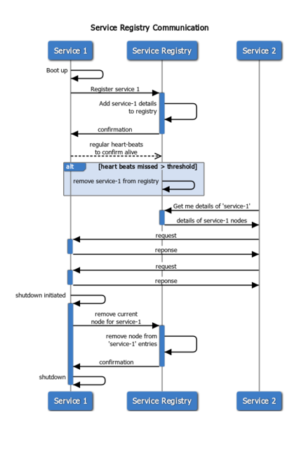
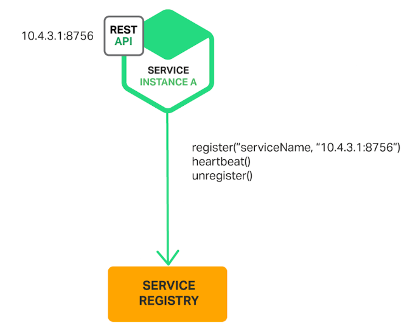
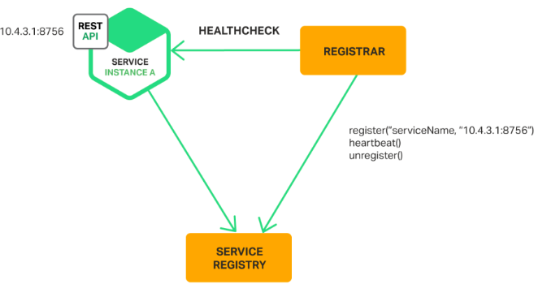
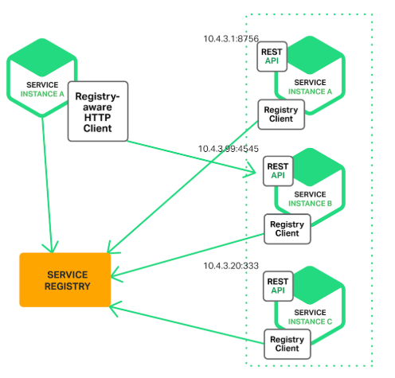
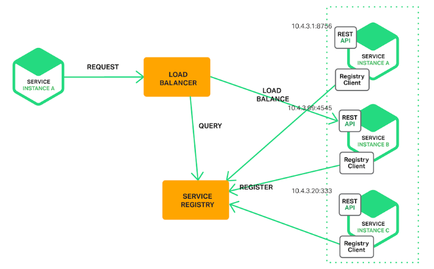
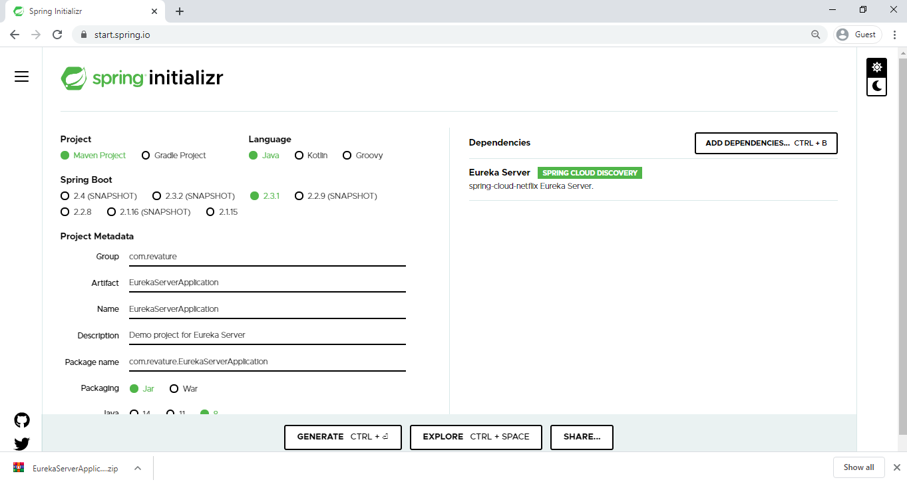
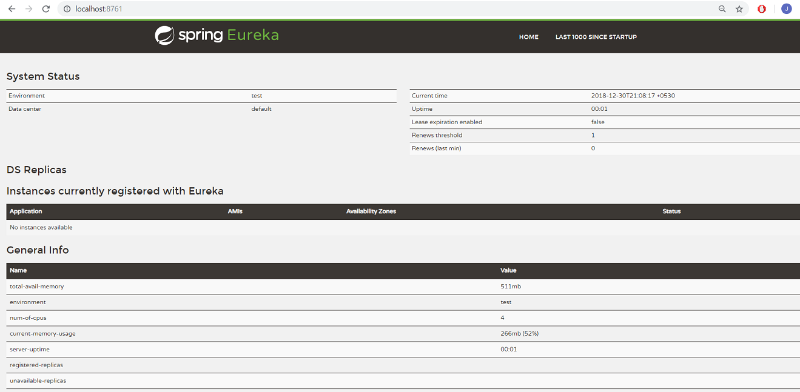
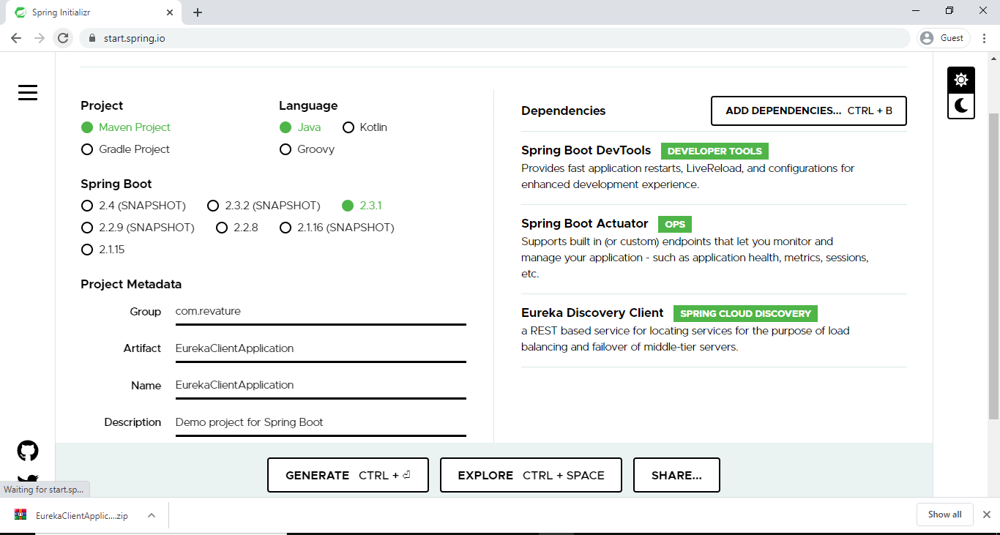
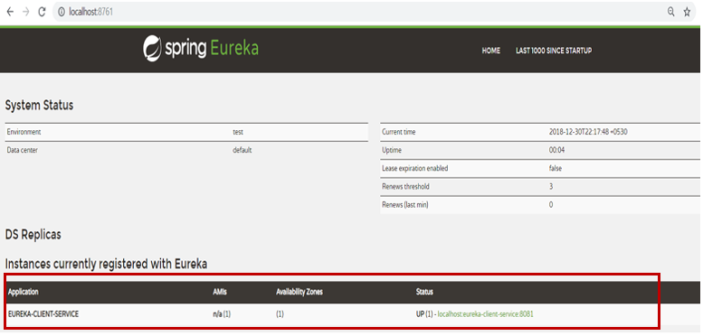

# Discovery Service

In a microservice architecture, applications are built up of self-sufficient units, which can be deployed and updated independently, and communicate with each other via REST APIs.

One of the challenges in a microservices application is how services discover and connect to each other, because service instances are constantly being created and destroyed according to scaling needs. Fixed IP addresses don't work, so we need a service registry to track the dynamic changes in the network locations of service instances. 

Service discovery is a method for application components to locate each other.  The service registry is a key part of service discovery.

## Service Registry

* A database containing the network locations of service instances.
* It contains the currently-available instances of each service and their connection details. 
* Services query the service registry to retrieve the details for the required microservice and then connect to it.  
* The registry maintains a **heartbeat mechanism** to see if services are still up and if not, removes them from the registry.



[Netflix Eureka](https://github.com/Netflix/eureka/wiki) is a good example of a service registry. It provides a REST API for registering and querying service instances. A service instance registers its network location using a POST request. Every 30 seconds it must refresh its registration using a PUT request. A registration is removed by either using an HTTP DELETE request or by the instance registration timing out. A client can retrieve the registered service instances by using an HTTP GET request.

Other examples of service registries - [etcd](https://etcd.io/), [consul](https://www.consul.io/), [Apache Zookeeper](https://zookeeper.apache.org/)

## Microservice Registration Patterns

There are two primary microservice registration patterns to handle the registration and deregistration of service instances in the Service Registry. 

1. Self-Registration Pattern
2. Third-party registration Pattern

### Self-Registration Pattern 

When using the self-registration pattern, a service instance is responsible for registering and deregistering itself with the service registry. Also, service instances send heartbeat requests to prevent their registration from expiring.



A good example of this approach is the **Netflix OSS Eureka client**. The Eureka client handles all aspects of service instance registration and deregistration. The **Spring Cloud** project, which implements various patterns including service discovery, makes it easy to automatically register a service instance with Eureka. We simply annotate our Java Configuration class with an `@EnableEurekaClient` annotation.

**Benefit** - This pattern is relatively simple and doesn’t require any other system components.

**Drawbrack** - This pattern couples the service instances to the service registry. We must implement the registration code in each programming language and framework used by our services.

### Third-party registration Pattern

When using the third-party registration pattern, service instances aren’t responsible for registering themselves with the service registry. Instead, another system component known as the **service registrar** handles the registration and deregistration. A service registrar is responsible for identifying that a service has started, registering the service, and unregistering the service when it shuts down or crashes.



Example of a service registrar - [Netflix OSS Prana](https://github.com/Netflix/Prana/wiki), 

The service registrar is a built-in component of deployment environments. The [EC2](https://aws.amazon.com/ec2/) instances created by an Autoscaling Group can be automatically registered with an AWS [Elastic Load Balancing](https://aws.amazon.com/elasticloadbalancing/) (ELB). [Kubernetes](https://kubernetes.io/) services are automatically registered and made available for discovery.

**Benefit** - Services are decoupled from the service registry. We don’t need to implement service‑registration logic for each programming language and framework used by our developers. Instead, service instance registration is handled in a centralized manner within a dedicated service.

**Drawbrack** - Unless it’s built into the deployment environment, it is yet another highly available system component that we need to set up and manage.

## Service discovery patterns

There are two main service discovery patterns:

1. Client-side discovery pattern
2. Server-side discovery pattern

### Client-Side Discovery Pattern

The client contacts a service registry, receives details for available services, and contacts one of them using a load balancing algorithm.

[Netflix OSS](https://netflix.github.io/) provides a great example of the client-side discovery pattern. 
 



### Server-Side Discovery Pattern

The client contacts a load balancer, making a request that indicates which type of service it needs. The load balancer consults the service registry, selects the optimal service (for example, the least loaded one) and routes the request to it. 

An example of a server-side discovery mechanism is AWS [Elastic Load Balancing](https://aws.amazon.com/elasticloadbalancing/) (ELB). A client makes requests (HTTP or TCP) via the ELB using its DNS name. The ELB load balances the traffic among a set of registered Elastic Compute Cloud (EC2) instances or EC2 Container Service (ECS) containers. There isn’t a separate service registry. Instead, EC2 instances and ECS containers are registered with the ELB itself.




In some deployment environments, we need to set up own service-discovery infrastructure using a service registry such as [Netflix Eureka](https://github.com/Netflix/eureka/wiki), [etcd](https://etcd.io/), or [Apache Zookeeper](https://zookeeper.apache.org/). In other deployment environments, service discovery is built in. For example, [Kubernetes](https://kubernetes.io/) and [Marathon](https://mesosphere.github.io/marathon/) handle service instance registration and deregistration. They also run a proxy on each cluster host that plays the role of server-side discovery router.

## Example - Netflix Eureka Server

Eureka Server is an application that acts as a service registry. Every Microservice will register itself into the Eureka server and the Eureka server knows all the client applications running on each port and IP address.

Naviagate to the [Spring Initializr](https://start.spring.io/) and create the Spring Boot project with Eureka server dependency. The following image shows the Initializr set up for the Eureka server application:



The preceding image shows the Initializr with Maven chosen as the build tool. It also shows values of `com.revature` and `EurekaServerApplication` as the Group and Artifact, respectively.

Verify you have Spring cloud Eureka server dependency is added under the `pom.xml` file.
 
```xml
<dependency>
<groupId>org.springframework.cloud</groupId>
   <artifactId>spring-cloud-starter-eureka-server</artifactId>
</dependency>
```

Open the the main application class file and enable the Eureka Server configuration by annotating the class with `@EnableEurekaServer`.

```java
@SpringBootApplication
@EnableEurekaServer
public class EurekaServerApplication {
    public static void main(String[] args) {
        SpringApplication.run(EurekaServerApplication.class, args);
    }
}
```
When the registry starts, it will complain (with a stacktrace) that there are no replica nodes to which the registry can connect. In a production environment, you will want more than one instance of the registry. For our simple purposes, however, it suffices to disable the relevant logging.

By default, the registry also tries to register itself, so you need to disable that behavior as well.

Add some properties under `application.properties` to handle all of these requirements. 
```properties
server.port=8761
# Port 8761 is the common port for Eureka Servers

eureka.client.register-with-eureka=false
eureka.client.fetch-registry=false
```
Here we're configuring an application port – *8761* is the default one for Eureka servers. 

Run the Eureka server application and visit the URL: http://localhost:8761/ , you able to see Eureka dashboard



You can see the Eureka server is up and running but no application is registered with it yet. Let's create a Spring Boot Client Application and register that Client Application With Eureka Server.


Navigate to [Spring Initializr](https://start.spring.io/) and create a Spring Boot  Application with DevTools, Actuator, and Discovery Client dependencies. The following image shows the Initializr set up for the Eureka Client application:



The preceding image shows the Initializr with Maven chosen as the build tool. It also shows values of `com.revature` and `EurekaClientApplication` as the Group and Artifact, respectively.

Open the the main application class file and enable the Eureka client configuration by annotating the class with ` @EnableDiscoveryClient`.

```java
import org.springframework.boot.SpringApplication;
import org.springframework.boot.autoconfigure.SpringBootApplication;
import org.springframework.cloud.client.discovery.EnableDiscoveryClient;

@SpringBootApplication
@EnableDiscoveryClient
public class EurekaClientApplication{
    public static void main(String[] args) {
        SpringApplication.run(EurekaClientApplication.class, args);
    }
}
```

We add a REST Controller class and implement a GET method in the class.
```java
@RestController
public class HelloWorldController {
@GetMapping("/hello-world/{name}")
public String getHelloWorld (@PathVariable String name)
{
return "Hello World "+name;
}
}
```
You need to add the below list of properties in `application.properties` to register this service in Eureka Server.
```properties
spring.application.name=eureka-client-service
server.port=8081
eureka.client.service-url.defaultZone=http://localhost:8761/eureka/
```
`eureka.client.service-url.defaultZone` determines the address where the Eureka Server is running so the client application can register itself in Eureka Server.

Before running this application, we need to make sure the Eureka Server is up and running. Run the Eureka Client application and navigate to the Eureka Server at http://localhost:8761/. This time we see that the client application registered in Eureka Server.




## References

* [Spring Cloud Netflix Eureka](https://github.com/Netflix/eureka/wiki)
* [Pattern: Client-side service discovery](https://microservices.io/patterns/client-side-discovery.html)
* [Pattern: Server-side service discovery](https://microservices.io/patterns/server-side-discovery.html)
* [Pattern: Service registry](https://microservices.io/patterns/service-registry.html)
* [Pattern: Self Registration](https://microservices.io/patterns/self-registration.html)
* [Pattern: 3rd Party Registration](https://microservices.io/patterns/3rd-party-registration.html)
