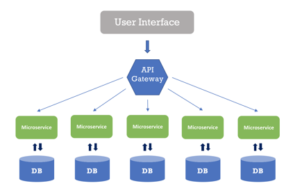
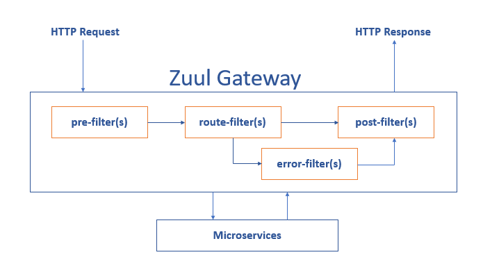
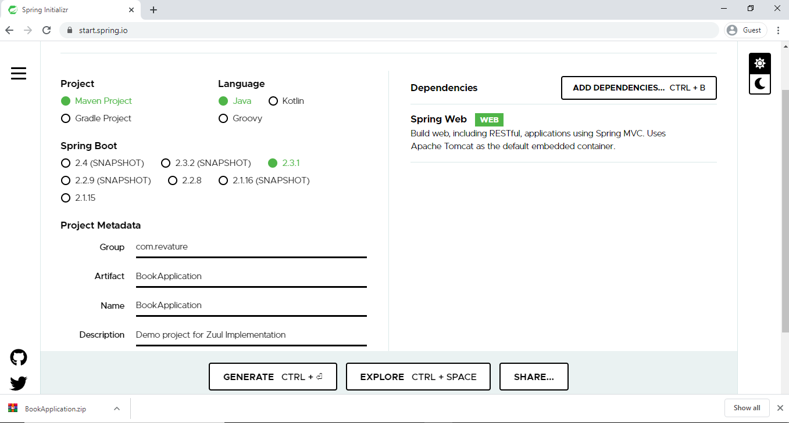
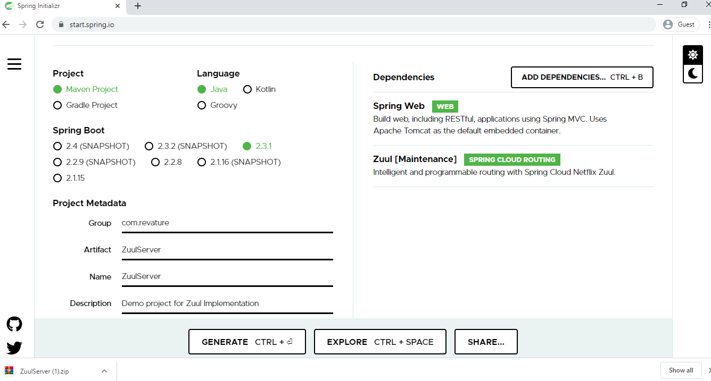

# API Gateway

An API gateway sits between a client and a collection of backend services. The API gateway takes all API requests from a client, determines which services are needed, and combines them into a synchronous experience for the user.

For most microservices-based applications, an API gateway acts as a single entry point into a system. The API gateway is responsible for request routing, composition, and protocol translation, and can streamline the system.  It handles some requests by simply routing them to the appropriate backend service, and handles others by invoking multiple backend services and aggregating the results. If there are failures in the backend services, the API gateway can mask them by returning cached or default data.



[Netflix Zuul](https://github.com/Netflix/zuul/wiki) is a good example of an API Gateway.

## Zuul Implementation

"Zuul is the front door for all requests from devices and web sites to the backend of the Netflix streaming application. As an edge service application, Zuul is built to enable dynamic routing, monitoring, resiliency and security. It also has the ability to route requests to multiple Amazon Auto Scaling Groups as appropriate." -- Zuul Wiki Page.

Zuul has mainly four types of filters that enable us to intercept the traffic in different timelines of the request processing for any particular transaction. We can add any number of filters for a particular url pattern.

* pre filters – executed before the request is routed.
* post filters – executed after the request has been routed.
* route filters – used to route the request.
* error filters – executed when an error occurs while handling the request.



Let's implement our own API Gateway with Spring Cloud and Zuul.

Let's create a service with a few REST endpoints for testing the proxy later. Navigate to [Spring Initializr](https://start.spring.io/) and create a Spring Boot Application with Spring Web dependency. The following image shows the Initializr set up for the Book application:



The preceding image shows the Initializr with Maven chosen as the build tool. It also shows values of `com.revature` and `BookApplication` as the Group and Artifact, respectively.

The BookApplication class marked with the` @RestController` annotation that return values from `@RequestMapping` methods - `available()` and `checkedOut()`. They handle requests to the `/available` and `/checked-out` paths, each of which returns the String name of a book.
```java
@RestController
@SpringBootApplication
public class RoutingAndFilteringBookApplication {

  @RequestMapping(value = "/available")
  public String available() {
    return "Spring in Action";
  }

  @RequestMapping(value = "/checked-out")
  public String checkedOut() {
    return "Spring Boot in Action";
  }

  public static void main(String[] args) {
    SpringApplication.run(RoutingAndFilteringBookApplication.class, args);
  }
}
```

In an `application.properties` file, set the server port and the application name.

```properties
spring.application.name=book
server.port=8081
```
Let's create a Zuul gateway which will proxy the *book* service. Navigate to [Spring Initializr](https://start.spring.io/) and create a Spring Boot Application with Spring Web and Zuul dependencies.



The preceding image shows the Initializr with Maven chosen as the build tool. It also shows values of `com.revature` and `ZuulServer` as the Group and Artifact, respectively.

Enable the embedded Zuul proxy by annotating the class with `@EnableZuulProxy` which turns the Gateway application into a reverse proxy that forwards relevant calls to other services - such as our book application.

```java
@EnableZuulProxy
@SpringBootApplication
public class RoutingAndFilteringGatewayApplication {

  public static void main(String[] args) {
    SpringApplication.run(RoutingAndFilteringGatewayApplication.class, args);
  }
  //Adding Zuul Filter class  
  @Bean
  public SimpleFilter simpleFilter() {
    return new SimpleFilter();
  }
}
```

To forward requests from the Gateway application, we need to tell Zuul the routes that it should watch and the services to which to forward requests that are made to those routes. We specify routes by setting properties under `zuul.routes`. Each of our microservices can have an entry under `zuul.routes.NAME`, where `NAME` is the application name (as stored in the `spring.application.name` property).

In the `application.properties` file, set the zuul routes and server port.

```properties
zuul.routes.books.url=http://localhost:8081
ribbon.eureka.enabled=false
# explicitly disables the use of Eureka in Ribbon
server.port=8080
```

Spring Cloud [Netflix Zuul](https://github.com/Netflix/zuul/wiki) uses [Netflix’s Ribbon](https://github.com/Netflix/ribbon/wiki) to perform client-side load balancing. By default, Ribbon would use [Netflix Eureka](https://github.com/Netflix/eureka/wiki) for service discovery. For this simple example, we skip service discovery by setting `ribbon.eureka.enabled` to `false`. 

 Spring Cloud Netflix picks up, as a filter, any `@Bean` that extends `com.netflix.zuul.ZuulFilter` and is available in the application context. Here, we enable the `pre` filter.
 ```java
 public class SimpleFilter extends ZuulFilter {

  private static Logger log = LoggerFactory.getLogger(SimpleFilter.class);

  @Override
  public String filterType() {
    return "pre";
  }

  @Override
  public int filterOrder() {
    return 1;
  }

  @Override
  public boolean shouldFilter() {
    return true;
  }

  @Override
  public Object run() {
    RequestContext ctx = RequestContext.getCurrentContext();
    HttpServletRequest request = ctx.getRequest();

    log.info(String.format("%s request to %s", request.getMethod(), request.getRequestURL().toString()));

    return null;
  }
}
```

Filter classes implement four methods:

* `filterType()` - returns a string that stands for the type of the filter (`pre`,`post`, `route`, `error`)
* `filterOrder()` - gives the order in which this filter is to be run, relative to other filters.
* `shouldFilter()` - contains the logic that determines when to run this filter 
* `run()`- contains the functionality of the filter.

Zuul filters store request and state information in the `RequestContext`. You can use that to get at the `HttpServletRequest` and then log the HTTP method and URL of the request before it is sent on its way.

Make sure that both applications are running. In a browser, visit one of the book application’s endpoints through the Gateway application (https://localhost:8080/books/available or https://localhost:8080/books/checked-out). The request’s method gets logged by the Gateway application before it is handed on to the Book application, as the following sample logging output shows:

```
2019-10-02 10:58:34.694  INFO 11608 --- [nio-8080-exec-4] c.e.r.filters.pre.SimpleFilter           : GET request to http://localhost:8080/books/available
```
We access the book service endpoints through the Gateway service.

# Reference

* [Spring Cloud Netflix Zuul](https://github.com/Netflix/zuul/wiki)
* [Pattern: API Gateway / Backends for Frontends](https://microservices.io/patterns/apigateway.html)
