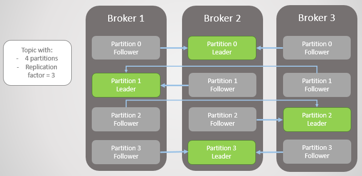

# Message Queues

A message queue is a software component used for passing data (messages) between services. It exposes an interface for adding, reading, and removing messages. Generally speaking, messages are persisted. 

Examples of Message Queues - [RabbitMQ](https://www.rabbitmq.com/), [Amazon SQS](https://aws.amazon.com/sqs/), and [Apache Kafka](https://kafka.apache.org/).

Message queues facilitate asynchronous communication between discrete services. There can be multiple **producers** (services adding messages to the queue) and
**consumers** (services taking messages from the queue). The producers and consumers are decoupled in time and space; a producer need not know when or by whom a message will be consumed. This feature has the following benefits:

* **Resiliency** - Isolated failures stay isolated. A consumer can go down temporarily and begin processing messages when it comes back online, without affecting other services.
* **Scalability** - To increase the rate at which messages are added or processed, simply add more producers or consumers.
* **Visibility** - Examining the queue itself can provide valuable insight into the health of an application.

## Messaging Models

### Point-to-Point Messaging Model

In the Point-to-Point messaging model, the producer is called as a *sender* and the consumer is called as a *receiver*. The most important characteristics of the point-to-point model are as follows:

- Senders and Receivers are exchange messages through a virtual channel called a queue. A queue is a destination to which producers send messages and a source from which receivers consume messages.

- Each message is delivered to only one receiver. Multiple receivers may listen on a queue, but each message in the queue may only be consumed by one of the queue’s receivers.

- Messages are ordered. A queue delivers messages to destined receiver in the order they were placed in the queue by the message server. As messages are consumed, they are removed from the head of the queue (unless message priority is used).


The sender sends the messages and those messages are registered in the queue. The messages registered in the queue are delivered to destined receivers running at that time (message1 and message2). Then, the delivered  messages are deleted/removed from the queue. If the destined receiver doesn't exist, the messages are accumulated in the queue (message3).

### Pub/Sub Messaging Model

The pub/sub messaging model allows a message producer (also called a publisher) to broadcast a message to one or more consumers (called subscribers). Publisher and Subscribers exchange means through an intermediary channel called as **topic**. **Publishers** produce messages to a topic and **Subscribers** subscribe to a topic and consume messages from a topic. Publishers doesn't have the knowledge about the subscribers.


A publisher creates and sends messages to a topic. Subscribers subscribe to a topic, to receive messages from it. Communication can be one-to-many, many-to-one, and many-to-many.

## Apache Kafka

We use Apache Kafka to enable communication between producers and consumers using message-based topics.

Apache Kafka is a distributed streaming platform, used to 

* Publish and subscribe to streams of records, similar to a message queue or enterprise messaging system.
* Store streams of records in a fault-tolerant durable way.
* Process streams of records as they occur.

Kafka run as a cluster on one or more servers that can span multiple datacenters. The **Kafka cluster** stores streams of records in categories called *topics*. Each record consists of a *key*, a *value*, and a *timestamp*.


* **Kafka Broker** - A Kafka broker (server) handles all requests from clients (produce, consume, and metadata) and persists and replicates the data within the cluster. There can be one or more brokers in a cluster. For the purpose of managing and coordinating, Kafka broker uses **ZooKeeper**. Also, uses it to notify producer and consumer about the presence of any new broker in the Kafka system or failure of the broker in the Kafka system. 

* **Kafka Topic** - A Topic is a category/feed name to which records are stored and published.

* A **Kafka Producer** pushes the message into the Kafka Topic. A **Kafka Consumer** pulls the message from the Kafka Topic.

* **Partitions in Kafka** - Kafka topics are divided into a number of partitions, which contain immutable sequence of records  records. Each record in a partition is assigned and identified by its unique *offset*. 


A topic can also have **multiple partition logs** distributed over the servers in the Kafka cluster with each server handling data and requests for a share of the partitions. This allows multiple consumers to read from a topic in parallel.

In Kafka, **replication** is implemented at the partition level. Each partition is replicated across a configurable number of servers for fault tolerance.

Each partition has one server which acts as the **leader** and zero or more servers which act as **followers**. The leader handles all read and write requests for the partition while the followers passively replicate the leader. If the leader fails, one of the followers will automatically become the new leader. Each server acts as a leader for some of its partitions and a follower for others so load is well balanced within the cluster.



* **Consumer group** - Consumers label themselves with a *consumer group name*, and each record published to a topic is delivered to one consumer instance within each subscribing consumer group. Consumer instances can be in separate processes or on separate machines.


### Apache Kafka as a Messaging System 

Messaging traditionally has two models: queuing and publish-subscribe

* **Queuing** or **Point to Point**- In a queue, a pool of Kafka consumers may read from a server. Also, each record goes to one of them here. 
    * Strength - It permits us to divide up the processing of data over multiple consumer instances, that help us scale our processing. 
    * Weakness - It is not multi-subscriber, as soon as one consumer reads the data it’s gone.

* **Publish-Subscribe** -  Publish-Subscribe allows us broadcast data to multiple consumer/subscriber, but has no way of scaling processing since every message goes to every subscriber.

In Kafka, these two concepts are generalized by the Kafka consumer group. As with a queue the consumer group allows us to divide up processing over a collection of processes (the members of the consumer group). As with publish-subscribe, Kafka allows us to broadcast messages to multiple consumer groups.

The advantage of Kafka's model is that every topic has both these properties:
    — it can scale processing and is also multi-subscriber
    — there is no need to choose one or the other.

Kafka has stronger ordering guarantees than a traditional messaging system, too. There is no parallelism in the processing in the traditional system, Kafka performs it well with the notion of parallelism. Kafka is able to provide both ordering guarantees and load balancing over a pool of consumer processes. 

### Spring for Apache Kafka

The Spring for Apache Kafka project applies core Spring concepts to the development of Kafka-based messaging solutions. It provides a "template" as a high-level abstraction for sending messages. It also provides support for Message-driven POJOs with `@KafkaListener` annotations and a "listener container". 

We add the below maven dependency to get started with Spring Boot and Kafka
```
<!-- https://mvnrepository.com/artifact/org.springframework.kafka/spring-kafka -->
<dependency>
    <groupId>org.springframework.kafka</groupId>
    <artifactId>spring-kafka</artifactId>
    <version>2.5.2.RELEASE</version>
</dependency>
```

**Features:**
* [`KafkaTemplate`](https://docs.spring.io/spring-kafka/api/org/springframework/kafka/core/KafkaTemplate.html) - A template for executing high-level operations.
* [`KafkaMessageListenerContainer`](https://docs.spring.io/spring-kafka/api/org/springframework/kafka/listener/KafkaMessageListenerContainer.html) -  used to construct an instance with the supplied configuration properties.
* [`@KafkaListener`](https://docs.spring.io/spring-kafka/api/org/springframework/kafka/annotation/KafkaListener.html) - Annotation that marks a method to be the target of a Kafka message listener on the specified topics. 


## References

* [Pattern: Messaging](https://microservices.io/patterns/communication-style/messaging.html)
* [Spring for Apache Kafka](https://docs.spring.io/spring-kafka/reference/html/)
* [How to Work with Apache Kafka in Your Spring Boot Application](https://www.confluent.io/blog/apache-kafka-spring-boot-application/)
